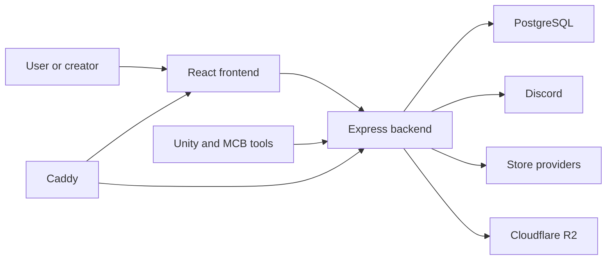

# Architecture Overview

Orbiters is a React frontend, an Express backend, PostgreSQL, Caddy, and a small deployment webhook service.

## Context View

## Container View

- Frontend: React, HeroUI, Redux Toolkit, and route-level pages.
- Backend: Express routes, Sequelize models, services, workers, and provider clients.
- Database: PostgreSQL with Sequelize sync and explicit migration blocks where needed.
- Caddy: TLS and host routing.
- Webhook service: deployment trigger helper.
- Documentation repo: Markdown content read by backend.

## Constraints

- API routes do not use an extra `/api` prefix.
- Backend and frontend can run locally or in Docker.
- Backend testing must use alternate ports such as `4200`.
- External vendors must be mocked in automated tests.
- Documentation visibility is enforced server-side.

