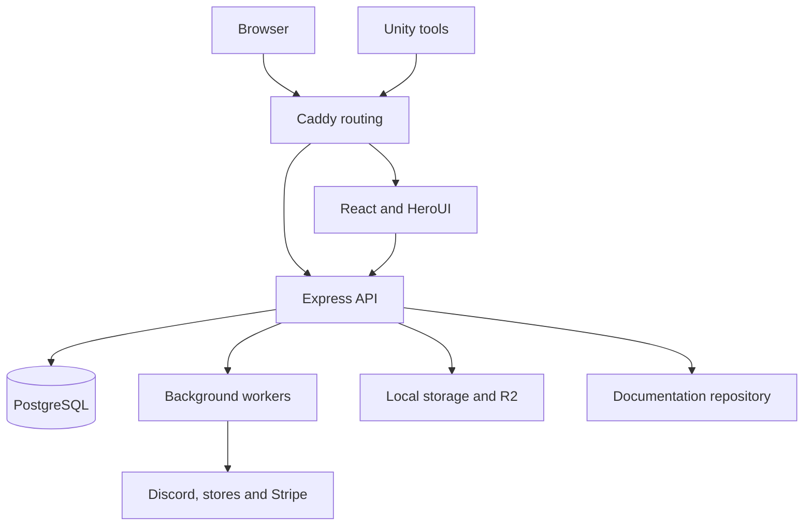

# The platform at a glance

Read the diagram from the outside in: people and Unity tools reach the application, domain services decide what may happen, and persistence or provider adapters carry out the result.

```mermaid
flowchart TD
  accTitle: Orbiters system map
  accDescr: Caddy routes browsers and tools to the application. Services use PostgreSQL, storage, documentation and providers.
  Browser[Browser] --> Caddy[Caddy routing]
  Unity[Unity tools] --> Caddy
  Caddy --> Web[React and HeroUI]
  Caddy --> API[Express API]
  Web --> API
  API --> DB[(PostgreSQL)]
  API --> Jobs[Background workers]
  Jobs --> Vendors[Discord, stores and Stripe]
  API --> Files[Local storage and R2]
  API --> Docs[Documentation repository]
```

## Boundaries to preserve

| Boundary | Responsibility |
| --- | --- |
| Browser → API | Authentication, input validation and permission checks |
| API → database | Durable domain state and transactions |
| Worker → provider | Bounded calls, retries and idempotency |
| File request → storage | Authorization before private content delivery |
| Markdown → reader | Audience and release filtering before rendering |

The deployment webhook is a separate helper. The Documentation checkout is a separate repository mounted read-only by the backend container.

## Local and container runs

Services can run locally or under Docker. Keep API paths directly under the configured backend origin. Tests use separate ports and disposable databases.

Continue with [runtime flows](/documentation/orbiters.architecture.runtime-flows), [the data model](/documentation/orbiters.architecture.data-model), or [Who sees what](/documentation/orbiters.reference.visibility-atlas).
