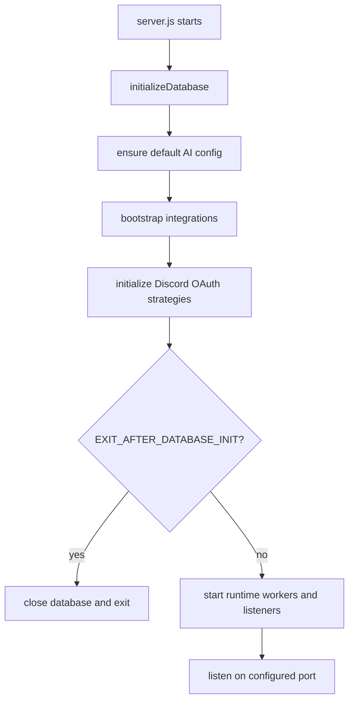
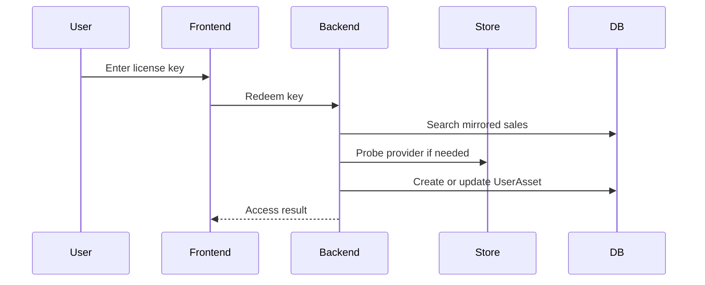
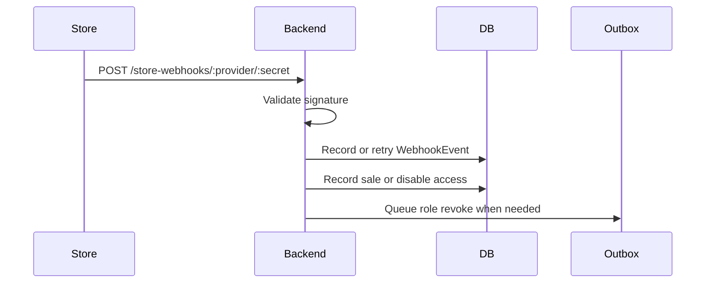
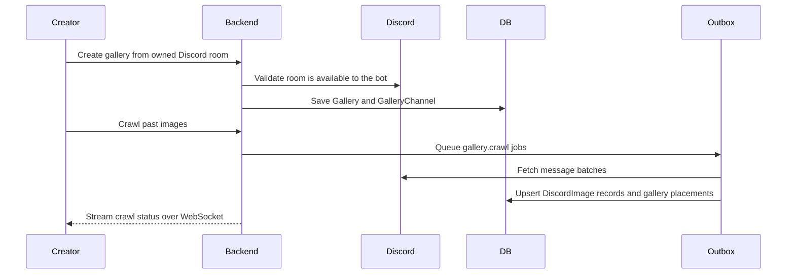
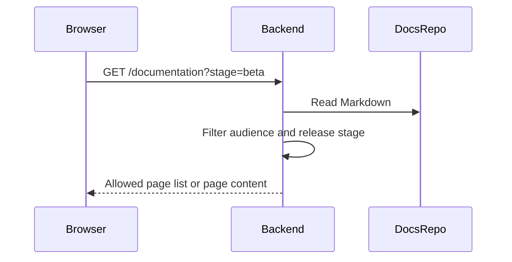

# Runtime Flows

This page summarizes the highest-risk runtime flows.

## Backend Startup

## License Redemption

## Store Webhook

## Discord Image Galleries

Live Discord message events use the same ingestion path as historical crawls. One
Discord message can produce multiple `DiscordImage` records, one per image attachment,
and each destination uses a separate `DiscordImagePlacement`.

## Documentation Request

