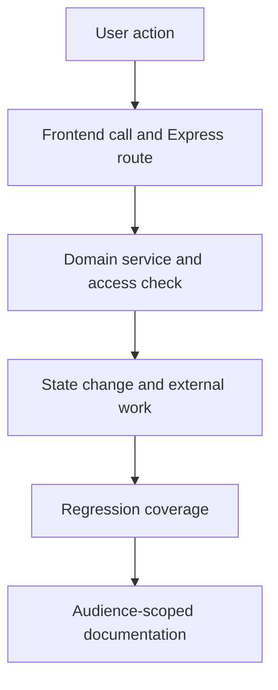

# Make a change you can explain and verify

Start at the user action, trace its route into the service that owns the decision, and test that boundary. ORBITERS has a React/HeroUI frontend, an Express backend and PostgreSQL.

## Find the right home

| Location | Responsibility |
| --- | --- |
| `frontend/src/components/pages` | Route-level experience |
| `frontend/src/components/elements` | Feature controls |
| `backend/src/routes` | Authentication, input and response wiring |
| `backend/src/services` | Domain decisions and provider coordination |
| `backend/src/models` | Persistence and startup migrations |
| `Documentation/docs` | Canonical user and contributor knowledge |

Prefer the codebase graph for symbols and call tracing. Read current source before editing; the index can lag behind recent work.

## Keep contracts aligned

API paths sit directly under the backend origin, with no extra `/api` prefix. Frontend calls use the shared backend client and `REACT_APP_BACKEND_URL`. Local and Docker runs are both supported.

External work must preserve durable state and use idempotency where an operation may be retried. A lease protects queue-row ownership; it does not make an external provider side effect exactly-once.

## Finish the change

Use [local setup](/documentation/orbiters.development.local-setup) and [testing](/documentation/orbiters.development.testing-strategy). Update the affected task guide and visibility reference. Documentation is a separate repository; follow the repository's commit and push instructions.
