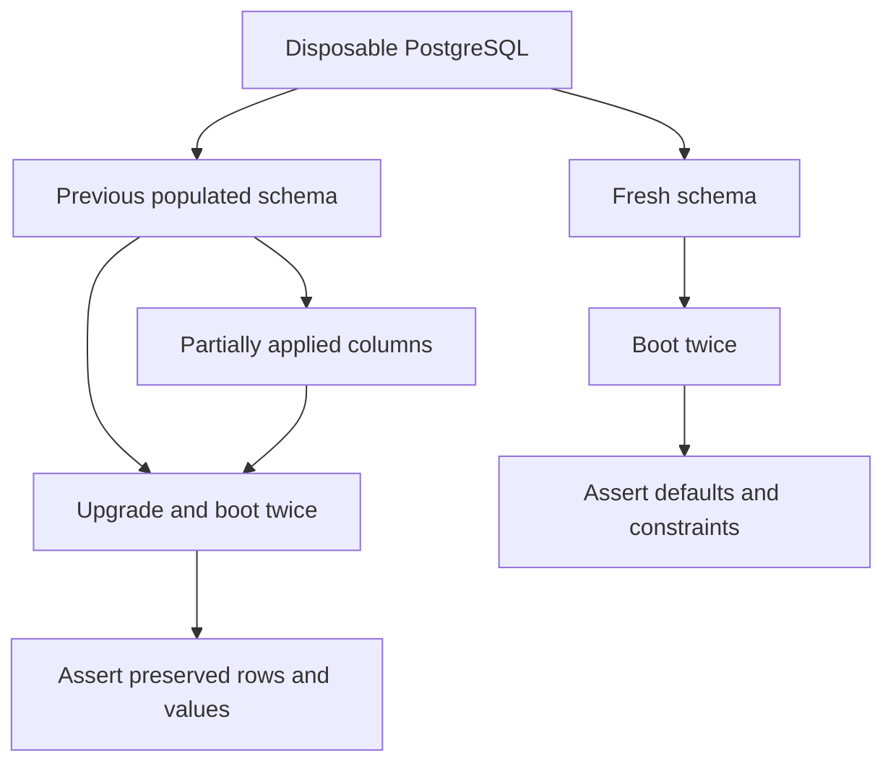

# Test the failure that would hurt a user

Choose tests around observable behavior: an authorization boundary, a payment outcome, a persisted record or a screen action. Use deterministic fixtures and stub remote providers.

| Change | Useful evidence |
| --- | --- |
| Domain decision | Table-driven cases including denial and edge cases |
| New route | Real router with authorized and unauthorized callers |
| Queue recovery | Interruption, reclaim and late completion |
| Commission state | Participant visibility and permitted transitions |
| Schema | Fresh, populated and partial upgrades |
| Documentation | Metadata, links, visibility filtering and actual diagram rendering |

```bash
cd backend
npm test
```

Frontend behavior tests and a production build check JSX, imports and integration with existing components. A successful build or mocked test does not prove a live vendor integration.

## Treat upgrades as a separate product path




Use an explicitly isolated database, never one selected accidentally from application environment files. Backfill required columns before schema sync enforces `NOT NULL`.

For startup checks set `FAIL_FAST=true`, `EXIT_AFTER_DATABASE_INIT=true`, `SKIP_EXTERNAL_STARTUP=true` and an alternate port such as `4200`. Ports 4000, 4100, 3000 and 3100 may already belong to development services.

The outbox upgrade test requires `RUN_OUTBOX_DB_TESTS=true`, `OUTBOX_TEST_PG_HOST=127.0.0.1` and a disposable PostgreSQL port of at least 54000. It uses fixture credentials and creates its own database. Read `backend/test/outboxLeaseDatabase.test.js` before running it.
