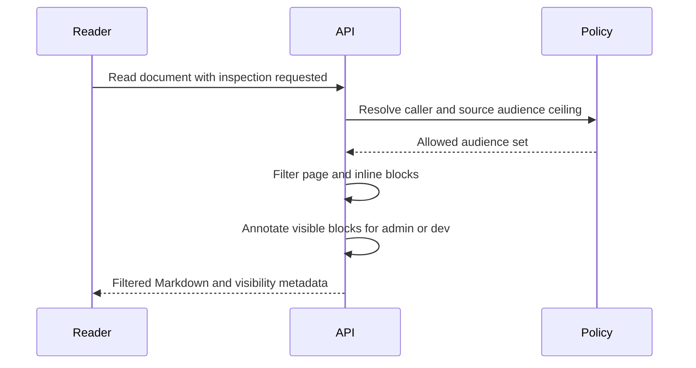

# Documentation System

The documentation system separates content from the website code. Markdown lives in the `Documentation` repo, while the Orbiters backend controls visibility and the frontend renders the allowed Markdown.

## Read Path

1. Backend receives `/documentation` or `/documentation/:slug`.
2. `documentationService` recursively reads Markdown files from `DOCUMENTATION_ROOT`.
3. Frontmatter sets navigation, audience, release stage, stable identity, domain,
   document type, owner, and verification date.
4. The service filters pages by user audience and selected release stage.
5. Inline audience and release-stage blocks are stripped when not visible.
6. The frontend renders the returned Markdown with `react-markdown`, GFM, highlighting, and sanitization.

## Page Metadata

Required frontmatter:

```md
---
title: Store Integrations
section: Creator Tools
order: 41
audience: creator, admin, dev
stage: stable
id: orbiters.how-to.store-integrations
domain: website
type: how-to
owner: orbiters-product
lastVerified: 2026-07-12
---
```

`slug` is optional. If omitted, the filename becomes the slug after removing an optional leading number.

`id` is permanent across file moves and title changes. `domain` identifies the
product area, while `type` describes the information shape. `owner` is accountable
for correctness. Update `lastVerified` only after checking the page against current
behavior. Run `node scripts/validate-docs.js` in this repository before review.

Application pull requests must select exactly one documentation-impact state and
give a concrete reason. When impact is declared `yes`, CI also requires the
Documentation gitlink or content to change between the pull request base and head.
This makes the documentation update part of feature completion rather than a later
cleanup task.

<alpha>

The Knowledge Base derives provenance, checksum, relations, backlinks, staleness,
and full-text search from this canonical Markdown. Its permission-scoped MCP surface
uses the same audience and release-stage rules. See **Documentation and Knowledge
MCP**.

</alpha>

## Inline Blocks

Audience block:

```md
<audience include="dev">
Internal implementation detail.
</audience>
```

Release-stage blocks:

```md
<beta>
Visible in beta and alpha mode.
</beta>

<alpha>
Visible in alpha mode only.
</alpha>
```

## Docker

Compose mounts the docs repo into backend containers:

```yaml
DOCUMENTATION_ROOT=/usr/src/documentation/docs
./Documentation:/usr/src/documentation:ro
```

Without that mount, the backend would start but return an empty docs list.

## Inspect audiences without changing access

Admins, developers and owners see a page visibility panel in the website reader. Base-profile badges answer who can read the page; a switch marks the beginning and end of allowed audience and release blocks.



`inspectVisibility=true` on document reads requests annotations. The service independently checks the caller rank; a query parameter cannot enable inspection for a regular user. Source ceilings still apply. A developer-only section remains absent from an admin response. Diagram requests check the current filtered page again.

The [visibility atlas](/documentation/orbiters.reference.visibility-atlas) explains account expansion. The [catalog](/documentation/orbiters.reference.documentation-audience-catalog) is generated from page metadata. Neither surface changes an application's resource authorization.

## Keep links and diagrams usable

The reader builds its section navigation from Markdown headings and accepts both LF and Windows CRLF line endings.

Use stable document IDs for website links: `/documentation/<document-id>`. IDs survive changes to titles and file names. The diagram's accompanying prose must explain its result and the meaning of branches; do not make readers depend on color alone.

Every Mermaid fence needs an accessible title and description. Render diagrams through the same backend engine before publishing, especially after changing node labels or adding sequence/state diagrams.
