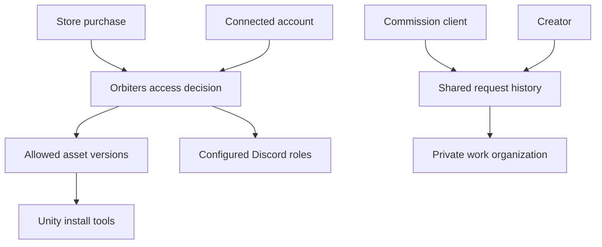

# How the pieces fit together

Orbiters connects records that otherwise live in separate places: a store purchase, a website account, a community role and a Unity project.

## One connection is not every permission

A login establishes identity. Store evidence establishes supported purchase access. A Discord integration determines which community the bot serves. Commission participation controls a private request. These relationships overlap, but each owns a different decision.

| Question | Start with |
| --- | --- |
| Can I download this version? | Asset access and release scope |
| Why is my role missing? | Asset-role mapping, membership and delivery result |
| Who can read my commission? | Request participants and attachment-sharing stage |
| Why is documentation absent? | Audience and selected release stage |

Creators connect their own stores and communities. Staff support those workflows through authorized tools. Unity tools use backend contracts; the local project remains where scene and mesh work happens.

<audience include="creator, admin, dev">

Read [the access model](/documentation/orbiters.reference.access-model) for the exact distinctions.

</audience>
