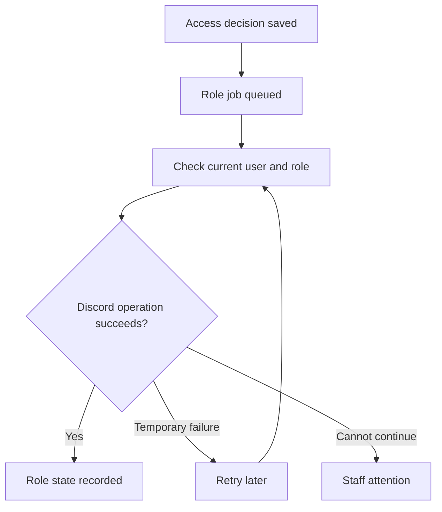

# Why your role can arrive after your access

Orbiters saves an access decision before asking Discord to change a role. A temporary Discord outage should not erase a valid website access record.




## Grants and removals have different checks

A grant needs the account's Discord identity, a configured role and a member present in the server. A removal first checks whether another enabled asset still grants the same role. Revoking one purchase must not remove access supplied by another valid asset.

Discord can reject an operation when the bot lacks permission, the role is unavailable or the member has left. Those are distinct from a temporary network error.

<audience include="admin, dev">

Repeated errors or interrupted attempts appear in [Background jobs](/documentation/orbiters.operations.background-jobs). Repair the underlying configuration before retrying a failed job. A queued role job is not proof that Discord already applied the change.

</audience>

## Reproduce the surprising case

A member has valid access. The bot has Manage Roles. Delivery can still fail because the target role is above the bot. That is why granting a broad permission is not a substitute for arranging the role list.

```orbiters
{"kind":"discord-roles"}
```

Use [Discord's hierarchy reference](https://support.discord.com/hc/en-us/articles/214836687-Discord-Roles-and-Permissions) for the provider rule, and the [integration guide](/documentation/orbiters.how-to.configure-discord-integrations) for Orbiters setup.
