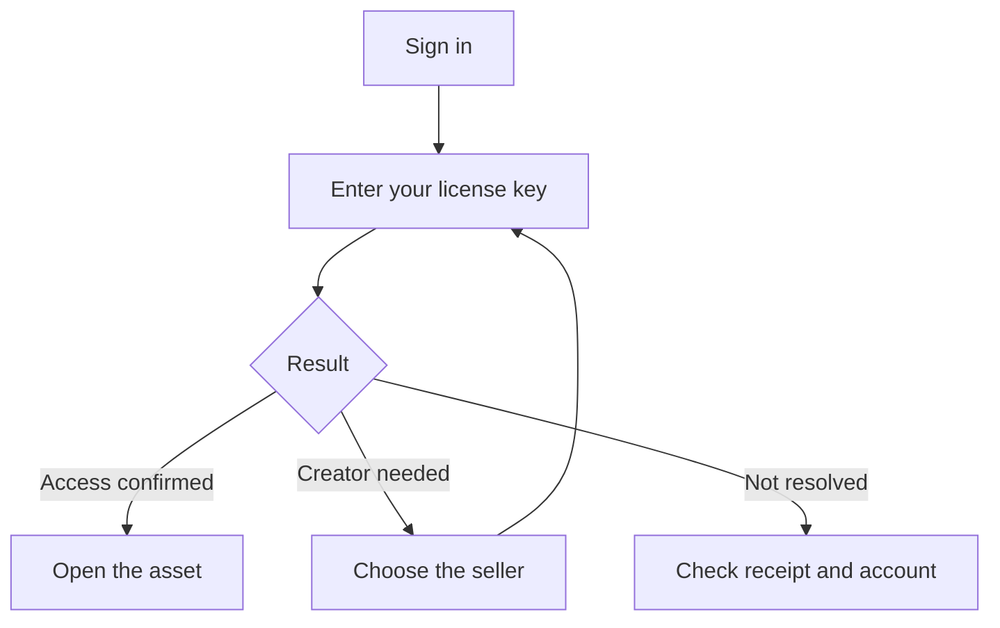

# Turn a purchase into Orbiters access

Have the license key from your store receipt ready. Redeeming it attaches the supported purchase to the Orbiters account you are currently using.

## Redeem the key

1. Sign in to the account that should receive access.
2. Open the asset page and enter the key exactly as the store supplied it.
3. Submit once and read the result.
4. If Orbiters asks for the creator, choose the seller and retry.

## Know what success gives you

The asset appears as owned. Public versions become available; beta and alpha versions still need the corresponding access scope. A configured Discord role is delivered separately, so website access can succeed before the role appears.

| What you see | Next step |
| --- | --- |
| Creator selection requested | Choose the creator who sold the item |
| Key not resolved | Check the copied key, seller and supported store |
| Asset unlocked, Discord role missing | Check your Discord connection and server membership |
| A beta version remains locked | Check your granted scope |

## Why the creator question exists

Orbiters searches connected stores under a limited request budget. A creator hint directs that search to the right integrations. It is not a second purchase or a request for your store password.

Matched refunds, chargebacks or disabled-license events can withdraw access later. Role removal also checks whether another enabled asset still grants that role.

<audience include="dev">

Access decisions belong in `accessPolicyService.canUserAccessAsset`. Keep enabled-state, scope and supporter-tier rules centralized when adding a route. See [license resolution](/documentation/orbiters.explanation.license-resolution) for the provider lookup boundary.

</audience>
