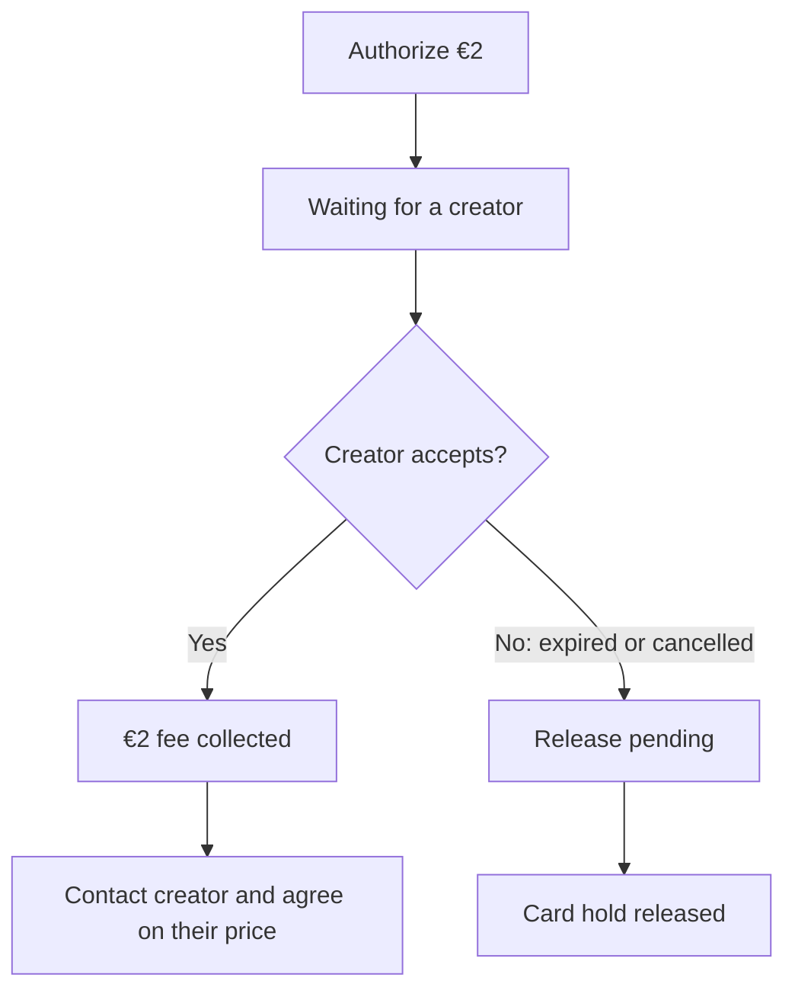
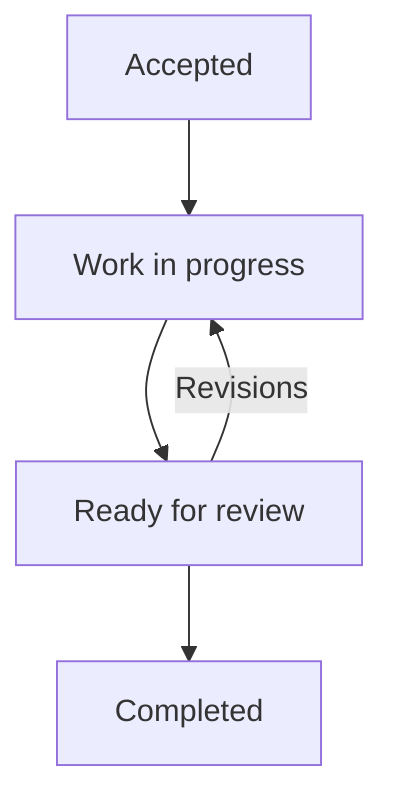

# Request a Manual ReFit Commission

Automatic ReFit not quite right? Ask a creator to finish the fit by hand.

> **Two separate prices:** Orbiters authorizes a **€2 request fee** and collects it
> only when a creator accepts. Agree on the **artist's price and payment directly
> with the artist**—the €2 does not pay for their work.

## Send your request

1. **Start in Unity.** After your ReFit, open **The ReFit doesn't look right?**,
   select available creators, then choose **Next**.
2. **Choose who to ask.** In the browser, arrange creators in preference order
   and choose their response limits (two days each by default).
3. **Review your request.** The asset, avatars and blendshape are already filled in.
   Review the receipt and choose **Next**.
4. **Authorize €2 in Stripe.** Return to Orbiters to follow the request.

## What happens to the request fee?

A card hold is temporary. The total request window is at most **six days**,
and may be shorter depending on the card's authorization deadline.

### Choose how creators receive the request

| Ask in preference order | Ask everyone at once |
| --- | --- |
| One creator receives the offer at a time. | All selected creators receive it together. |
| A decline or timeout moves to the next creator. | The first creator to accept gets the job. |

When someone accepts, other offers close. You receive an Orbiters notification,
plus push or Discord notifications when available. Open the request to find the
creator's profile and contact links.

## Follow the work

Open **My Account → My commissions**, or select a commission in your avatar menu.

These are milestones, **not a delivery countdown**. The creator updates the stage
and can add notes or delivery links. Completed or closed requests move to
**Past commissions**.

## Need help?

| What you see | What to do |
| --- | --- |
| Checkout was interrupted | Open the saved request and choose **Continue to payment** when ready. |
| **Release pending** | The provider has not confirmed release of the hold yet. |
| No creator accepted | Check whether the next creator is being asked or the request has expired. |
| The payment panel says **Paid** | The creator accepted and Orbiters collected the request fee. |

Before acceptance, creators see an offer and its deadline—not your identity or
technical asset details. Acceptance reveals that context to the accepting creator.

<audience include="creator, admin, dev">

**Are you a creator?** Read [Accept ReFit commissions](/documentation/orbiters.how-to.accept-refit-commissions).

</audience>
