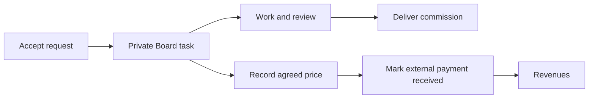

# Your Commission Workspace

Use **Home → Your workspace** for quick task moves. Open **Full Board** when you
need its settings or more room.

## Move or Add Work

- Choose one of your Boards in the Home selector.
- Drag a task between columns, or use its **Move to** menu on touch or keyboard.
- Select **New commission** in a column to enter a name and brief. This creates a
  private task, not a customer request, payment or asset listing.
- Open a task to read its brief, attachments and linked commission details.

Accepting an art request creates one private task in your configured commission
Board. Without a configured Board, it uses your Creations Board. ReFit keeps its
existing acceptance and placement workflow.

**Board columns and customer-facing delivery stages are separate.** Use the
commission's **Start work**, **Ready for review**, and completion controls to
update the customer. Moving a Board task does not claim a payment or delivery.

## Record Your Price and Payment

Open a commission request or its linked task and find **Artist payment**.

1. Enter the agreed price and currency, then **Save payment record**.
2. After receiving money directly, check **Payment received externally**, enter
   the actual receipt date, and save again.
3. Open **Creator → Revenues**. The payment appears under **Recorded commissions**.

Only record payments **not already imported from your shop**. A manual record and
an imported shop sale are not automatically recognized as the same transaction.

This is bookkeeping: Orbiters does not charge the customer, transfer money or
verify the external payment. The customer sees the recorded price/payment state
but cannot edit it. To correct a received amount or currency, uncheck received,
save, make the correction, and mark it received again. A stale-edit warning means
someone saved a newer version; reload before saving your correction.

The yellow **Orbiters · ReFit request fee** receipt is separate from your price.
It describes the platform request fee, not an artist payment or tax invoice.

## Trello References

For a [connected Trello Board](09-connect-and-sync-trello.md), synchronization
uploads the commission's shared Sona images and request attachments to its Trello
card. References come from the submitted request, not later changes to a Sona.

**Trello Board members can read those uploaded copies.** Review your Trello
membership before assigning private commission work there. Removing a Sona or
disconnecting Trello does not remove copies already uploaded to Trello.

Orbiters shows an attachment-based Trello card cover on the Board. Open the task
to preview supported image attachments, download uploaded files, or open external
attachment links. Private uploaded files require Orbiters Board membership and
task access; they are not made public to work around Trello authentication.
Files above the 10 MB preview/download limit must be opened on Trello.

## Find Your Own Requests

Customers use **My Account → My commissions** or the account menu. More than two
items switch to compact rows while retaining the title, artist and progress bar.
Commission task discussions omit proposal sentiment and product-decision controls.
