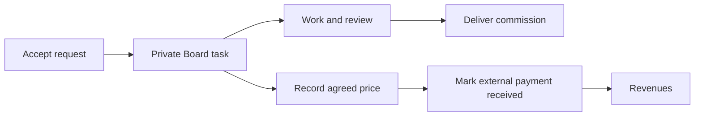

# Your Commission Workspace

Use **Home → Your workspace** for quick task moves. Open **Full Board** when you
need its settings or more room.

For creators, Home opens directly on the workspace without the Orbiters hero or
development warning. In **Creator → Commissions → Your commission workspace**,
choose your **Default Board** and starting column, then save. This shared setting
applies to art and ReFit work and selects that Board automatically on Home. You
can temporarily browse another Board using Home's selector without changing the
saved default.
On small screens, the Creator page uses a **Creator section** selector instead
of a wide sidebar. The top shortcuts jump to Board and announcement settings.

## Move or Add Work

- Choose one of your Boards in the Home selector.
- Drag a task between columns, or use its **Move to** menu on touch or keyboard.
- Select **New commission** in a column to enter a name and brief. This creates a
  private task, not a customer request, payment or asset listing.
- Click a task to open a quick-view modal. Read the brief, requester, commission
  state and recorded payment without leaving the Board. Use the small **Open full
  element** button in its header for the full page.
- Character references, request attachments and supported Trello images appear
  immediately in the preview. Use each image's corner **Download** button to save
  it, or click the image to open a larger view. Access checks still apply.
- Scroll the modal with the mouse wheel or touch. It uses one scroll area and a
  spring entry/exit animation. Large dialogs use a smaller opening tilt to avoid
  sweeping across the screen; reduced-motion preferences disable movement.

Accepting an art request creates one private task in your configured commission
Board. Without a configured Board, it uses your Creations Board. ReFit keeps its
existing acceptance and placement workflow.

**Board columns and customer-facing delivery stages are separate.** Use the
commission's **Start work**, **Ready for review**, and completion controls to
update the customer. Moving a Board task does not claim a payment or delivery.

## Record Your Price and Payment

Open a commission request or its linked task and find **Artist payment**.

1. Enter the agreed price and currency, then **Save payment record**.
2. After receiving money directly, check **Payment received externally**, enter
   the actual receipt date, and save again.
3. Open **Creator → Revenues**. The payment appears under **Recorded commissions**.

Only record payments **not already imported from your shop**. A manual record and
an imported shop sale are not automatically recognized as the same transaction.

This is bookkeeping: Orbiters does not charge the customer, transfer money or
verify the external payment. The customer sees the recorded price/payment state
but cannot edit it. To correct a received amount or currency, uncheck received,
save, make the correction, and mark it received again. A stale-edit warning means
someone saved a newer version; reload before saving your correction.

The yellow receipt itemizes the **Orbiters request fee** and, once recorded, the
**Artist commission** price. Saving the artist record updates the receipt and
total immediately. Prices in the same currency are added; different currencies
keep separate totals, without an invented conversion. Each line retains its own
payment state: an agreed artist price is not proof of payment or a Stripe charge.
This summary is not a tax invoice.
In the ReFit request view, the compact creator identity sits above this receipt
in the right-hand column; cutout edges distinguish the receipt from other cards.

## Trello References

For a [connected Trello Board](09-connect-and-sync-trello.md), synchronization
uploads the commission's shared Sona images and request attachments to its Trello
card. References come from the submitted request, not later changes to a Sona.

**Trello Board members can read those uploaded copies.** Review your Trello
membership before assigning private commission work there. Removing a Sona or
disconnecting Trello does not remove copies already uploaded to Trello.

Orbiters shows an attachment-based Trello card cover on the Board. Open the task
to preview supported image attachments, download uploaded files, or open external
attachment links. Private uploaded files require Orbiters Board membership and
task access; they are not made public to work around Trello authentication.
Files above the 10 MB preview/download limit must be opened on Trello.

Board covers use small, lazily loaded previews rather than downloading the full
image to the browser. Orbiters generates a PNG of at most 480 × 320 pixels on
first use and caches it privately. The first uncached image still requires a
Trello download; subsequent views reuse the stored preview. Opening/downloading
references uses the original. Authorization is checked even for cached previews.

<audience include="dev">
Thumbnail files live in `backend/.cache/trello-thumbnails`, outside public file
serving. They are disposable, expire after seven days, and are pruned to 2,000
files on generation. Generation is deduplicated with four concurrent workers;
inputs retain the 10 MB download limit and a 40-million-pixel decoder limit.
</audience>

## Find Your Own Requests

Customers use **My Account → My commissions** or the account menu. More than two
items switch to compact rows while retaining the title, artist and progress bar.
The artist sits beside the title, rather than taking another row in each card.
Commission task discussions omit proposal sentiment and product-decision controls.
