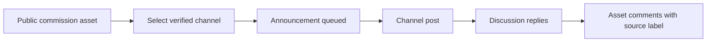

# Announce a Commission Asset

Connect a channel once, then select **Post on [channel]** when saving a public
commission asset. Posting is optional and starts unchecked. Each listing gets
one announcement per channel; editing it does not create repeated posts.

Announcements include the public listing preview, name, short description,
starting price and link. **Private customer requests, Sonas and their references
are never used as announcement content.**

## Connect Telegram

1. Link your Telegram identity in your Orbiters account.
2. Add the deployment's Orbiters bot as administrator to your announcement
   channel, with permission to post messages.
3. Link a discussion group to the channel and add the bot as administrator there
   too. Comments live in that group, not in the channel itself.
4. In the commission asset editor, open **Announce your commission → Connect a
   channel → Telegram**.
5. Enter its `@channel` name or numeric channel ID and select **Verify & connect**.

Your linked Telegram identity must administer the channel. A channel already
connected to another creator cannot be claimed by entering its ID.

## Connect Discord

1. Link your Discord identity and invite the Orbiters bot to the server.
2. Choose a text or announcement channel. Your identity needs **Manage Channels**.
3. Grant the bot **View Channel**, **Send Messages**, **Read Message History**,
   **Create Public Threads**, and **Send Messages in Threads**. Image attachments
   also require **Attach Files**.
4. In **Connect a channel → Discord**, enter the server ID and channel ID, then
   verify. Discord's Developer Mode exposes **Copy ID** in context menus.

Orbiters creates a discussion thread on the announcement. Replies there, or direct
replies to the announcement in its channel, are mirrored. The deployment must have
Discord's Message Content intent enabled for text to be available.

## Publish and Check Delivery

Enable **Public on Assets**, select the channels, and save. The listing and
announcement jobs are saved together: a provider outage does not require creating
the listing again.

Reopen the listing editor and use **Refresh status** to check delivery. If the
result is uncertain, first inspect the channel. **Check & retry** requires you to
confirm that no post exists, because a network timeout can happen after sending.
Do not confirm absence when a post is present. A Discord thread-setup retry reuses
the existing post instead of publishing again.

Disconnecting stops further posting and comment import. It does not delete
external posts or already imported comments. Unpublishing removes the listing
and its discussion from public Orbiters access but does not remove channel posts.

## Public Comment Rules

- Text replies and captions retain their Telegram/Discord label.
- A matching linked account is shown as the Orbiters author. Otherwise the source
  display name is shown without claiming an Orbiters identity.
- Bot messages and Telegram anonymous channel identities are ignored.
- Use **Hide Telegram comments** or **Hide Discord comments** to filter the list.
- The author, asset owner or moderators can hide a comment on Orbiters. It stays
  hidden even if the source sends another update; this does not delete it upstream.
- Discord edits/deletions and Telegram edits are mirrored while connected.
  Telegram's ordinary bot updates do not provide comment-deletion events.
- Website comments are not posted back to either platform. Historical channel
  discussions are not backfilled; only replies associated with Orbiters posts
  received after connection are imported.

The announcement tells commenters their display name and reply will appear on
Orbiters. Keep personal details and character references in private requests.

<audience include="admin, dev">

## Administrator Prerequisites

In **Admin → API Keys**, add **Telegram announcement bot** as a global,
environment-specific record:

| Field | Value |
| --- | --- |
| Bot API token | The bot access token from BotFather, not a Login Widget secret |
| Webhook secret | A random 32–256-character secret using letters, digits, `_`, `-` |

Register Telegram's `setWebhook` with the public API URL shown in the setup guide,
ending in `/commission-channels/telegram/webhook`. Set `secret_token` to the same
secret and `allowed_updates` to `["message", "edited_message"]`. Keep secrets out
of browser URLs, screenshots and logs. Check `getWebhookInfo` for delivery errors.

A hosts-file-only development name is not reachable by Telegram. Use a public
HTTPS tunnel that forwards this endpoint to development, and a **separate bot**
from production: one Telegram bot has one webhook. Saving the API key alone does
not register or replace the provider webhook.

Discord uses the existing shared/custom-bot client manager and guild routing;
no second client is created. Enable the Message Content intent in the Developer
Portal and keep the existing bot integration active.

Set `FRONTEND_URL` (or `FRONT_URL`) to the website's HTTPS URL for announcement
links. Keep the public API and frontend origins distinct.

</audience>
