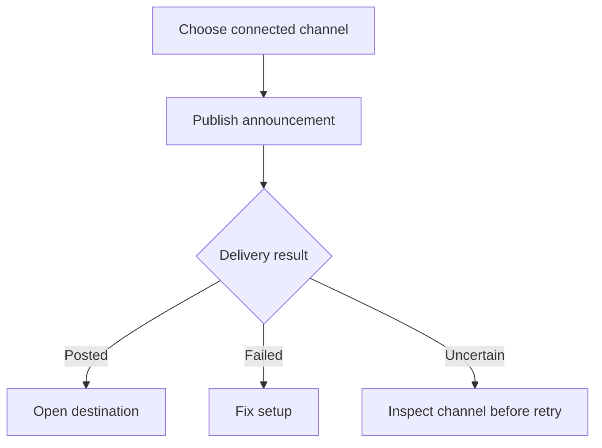
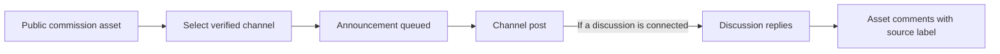

# Announce a Commission Asset

Inspect the destination before retrying an uncertain announcement.



## In this guide

Connect Telegram · Connect Discord · Publish and Check Delivery · Public Comment Rules · Administrator Prerequisites

Connect a channel once, then select **Post on [channel]** when saving a public
commission asset. Posting is optional and starts unchecked. Each listing gets
one announcement per channel; editing it does not create repeated posts.

Start in **Creator → Commissions → Automate your commission announcements**.
The setup guide checks bot readiness and your linked identity before you connect.
If something is missing, it explains whether you or the website administrator
needs to act. You can also open the same guide from the commission asset editor.

Announcements include the public listing preview, name, short description,
starting price and link. **Private customer requests, Sonas and their references
are never used as announcement content.**



## Connect Telegram

1. Select **Telegram** in the setup guide. Link your Telegram identity in
   **Account → Overview** if prompted.
   If Account → Connections offers **Reconnect Telegram**, use it once. This
   repairs an earlier login-ID mapping issue using a verified Telegram login;
   it keeps your existing Orbiters account and does not require unlinking it.
2. In **This deployment’s announcement bot**, use **Copy bot username** or
   **Open this bot in Telegram**. Search the exact `@username` in Telegram’s
   **Add Administrators** screen, not “Orbiters”. The identity remains visible
   before webhook registration is complete, provided the Bot API token is valid.
   Alternatively select **Add bot to Telegram channel**. Give it **Post Messages**.
3. **Optional: sync Telegram comments.** Link a discussion group to the channel
   and add the bot as administrator there too. Without a discussion group,
   announcements still work; customers can comment directly on the Orbiters listing.
4. Return to Orbiters and select **Refresh setup**.
5. Search **Telegram channel** and select your channel, then **Verify & connect**.
   The picker includes private channels. **Refresh channels** checks again.

**Channel missing?** If the bot was added before discovery was enabled, ask the
administrator to rerun the current webhook command in API Keys. Publish a new
post in the channel, then refresh the picker. Telegram does not replay old bot
membership events. You can also expand **Channel missing?** and paste the
channel's `@username` or a link copied from one of its posts once. No numeric ID
is needed. Newly added channels are discovered from the bot's membership update.

Your linked Telegram identity must administer the channel. A channel already
connected to another creator cannot be claimed by entering its username.
Telegram does not expose a list of all channels through the bot API. Orbiters
remembers channels from authenticated bot-membership and channel-post updates,
and checks your current administration rights and the bot's membership before
showing them. Discovery records are scoped to the environment's bot, and contain
channel metadata and administrator IDs, not post text or character references.

## Connect Discord

1. Select **Discord**. Link or reconnect it in **Account → Overview** if prompted.
2. Search and select your **Discord server** by name. Use **Invite bot to Discord**
   if needed; the selected server is prefilled. Inviting needs **Manage Server**,
   so ask a server administrator if you cannot invite applications yourself.
3. Return and select **Refresh setup**, then search **Announcement channel**.
   Only text/announcement channels your linked account can view and manage are
   offered. No Developer Mode or copied IDs are needed.
4. If a channel says **Bot permissions needed**, grant **View Channel**,
   **Send Messages**, **Read Message History**,
   **Create Public Threads**, and **Send Messages in Threads**. Image attachments
   also require **Attach Files**. Refresh after changing permissions.
5. Select **Verify & connect**. Orbiters rechecks your permission and the bot's
   permission before connecting.

Server and channel choices filter as you type. Discord setup does not wait for
Telegram checks; switching back reuses the loaded server list until you select
**Refresh setup** or leave the form. Channel permissions are still checked live.

You do not need to create a Discord application or enter an API key. When the
deployment's shared bot is unconfigured or offline, the guide asks the website
administrator to finish its setup. Invite links use the standard
[Discord bot authorization flow](https://docs.discord.com/developers/topics/oauth2)
and [Telegram bot channel links](https://core.telegram.org/api/links#bot-links).

Orbiters creates a discussion thread on the announcement. Replies there, or direct
replies to the announcement in its channel, are mirrored. The deployment must have
Discord's Message Content intent enabled for text to be available.

## Publish and Check Delivery

Enable **Public on Assets**, select the channels, and save. The listing and
announcement jobs are saved together: a provider outage does not require creating
the listing again.

Reopen the listing editor and use **Refresh status** to check delivery. If the
result is uncertain, first inspect the channel. **Check & retry** requires you to
confirm that no post exists, because a network timeout can happen after sending.
Do not confirm absence when a post is present. A Discord thread-setup retry reuses
the existing post instead of publishing again.

Disconnecting stops further posting and comment import. It does not delete
external posts or already imported comments. Unpublishing removes the listing
and its discussion from public Orbiters access but does not remove channel posts.

## Public Comment Rules

- Text replies and captions retain their Telegram/Discord label.
- A matching linked account is shown as the Orbiters author. Otherwise the source
  display name is shown without claiming an Orbiters identity.
- Bot messages and Telegram anonymous channel identities are ignored.
- Use **Hide Telegram comments** or **Hide Discord comments** to filter the list.
- The author, asset owner or moderators can hide a comment on Orbiters. It stays
  hidden even if the source sends another update; this does not delete it upstream.
- Discord edits/deletions and Telegram edits are mirrored while connected.
  Telegram's ordinary bot updates do not provide comment-deletion events.
- Website comments are not posted back to either platform. Historical channel
  discussions are not backfilled; only replies associated with Orbiters posts
  received after connection are imported.

The announcement tells commenters their display name and reply will appear on
Orbiters. Keep personal details and character references in private requests.

<audience include="admin, dev">

## Administrator Prerequisites

In **Admin → API Keys**, add **Telegram announcement bot** as a global,
environment-specific record:

**Use the same bot for Telegram Login and announcements.** Select that bot in
BotFather for both API-key records. Login uses its Login Client ID/Secret and
OAuth callback; announcements use its Bot API token and update webhook. These
are different credentials for one bot, not a reason to create another bot.
Registering the update webhook does not replace the Login callback.

| Field | Value |
| --- | --- |
| Bot API token | The bot access token from BotFather, not a Login Widget secret |
| Webhook secret | A random 32–256-character secret using letters, digits, `_`, `-` |
| Public webhook URL (optional) | Filled automatically by the local development bridge; leave blank for the deployment URL |

Register Telegram's `setWebhook` with the public API URL shown in the setup guide,
ending in `/commission-channels/telegram/webhook`. Set `secret_token` to the same
secret and `allowed_updates` to `["message", "edited_message", "my_chat_member", "channel_post", "edited_channel_post"]`. Keep secrets out
of browser URLs, screenshots and logs. Check `getWebhookInfo` for delivery errors.

There is **no BotFather field for this webhook secret**. In the API key create or
edit form, paste the Bot API token and choose **Generate new secret**. Select
**Copy PowerShell command**, save the key, then run the copied command in
PowerShell. The command updates automatically from the current fields; the
preview masks secrets. Blank fields representing hidden saved values are
prompted privately instead. Stored secrets are never fetched back for display.
The secret maps to **`secret_token`** and the URL to **`url`**.
The copied command contains entered credentials: keep it private, including
clipboard contents and terminal history. Execution does not print credentials.

Generating does not change Telegram or the saved API key by itself. Replacing a
saved secret requires running registration again. Registration replaces that
bot’s previous webhook, so do not reuse your production bot for development.
You do not need separate development bots for login and announcements.

A hosts-file-only development name is not reachable by Telegram. Use a public
HTTPS tunnel that forwards this endpoint to development, and a **separate bot**
from production: one Telegram bot has one webhook. Saving the API key alone does
not register or replace the provider webhook.

### Local development: start the restricted bridge

Run the backend normally, with its active **dev** Telegram bot key saved. Install
[cloudflared](https://developers.cloudflare.com/cloudflare-one/networks/connectors/cloudflare-tunnel/downloads/)
on PATH (or set `CLOUDFLARED_BIN` to the executable). From `backend`, run:

```sh
npm run telegram:bridge
```

The helper creates a temporary public HTTPS tunnel, waits for it to work, registers
the existing bot webhook without discarding queued updates, and saves its public
URL on the dev API key. It does **not** change Telegram Login or its callback.
Keep it running while testing. Restart it after reboot or tunnel shutdown; the
temporary URL changes and is registered again automatically. This is a development
helper, not a production tunnel or an automatically installed startup service.

Only authenticated POST requests to `/commission-channels/telegram/webhook` pass
through. Other paths/methods return 404; missing or incorrect webhook secrets
return 403. Bodies are limited to 256 KiB. The gateway listens only on localhost
port 4215 and forwards to local port 4100. Set `TELEGRAM_BRIDGE_BACKEND_URL` if the
local backend uses another port; remote targets are rejected. No login, admin,
API-key or other backend routes are exposed through this bridge.

For the Windows workspace helper, a verified executable at
`backend/.cache/tools/cloudflared.exe` is also detected. Tunnel diagnostics are in
`backend/.cache/telegram-tunnel.log`; these files are not committed.

If Telegram reports an SSL handshake error or pending updates keep increasing,
the public webhook is not delivering to your backend. Re-adding the bot does not
repair HTTPS. Start the bridge and verify `getWebhookInfo` shows the bridge URL
and a draining queue. Channel discovery then uses delivered updates.

Discord uses the existing shared/custom-bot client manager and guild routing;
no second client is created. Enable the Message Content intent in the Developer
Portal and keep the existing bot integration active.

Set `FRONTEND_URL` (or `FRONT_URL`) to the website's HTTPS URL for announcement
links. Keep the public API and frontend origins distinct.

</audience>