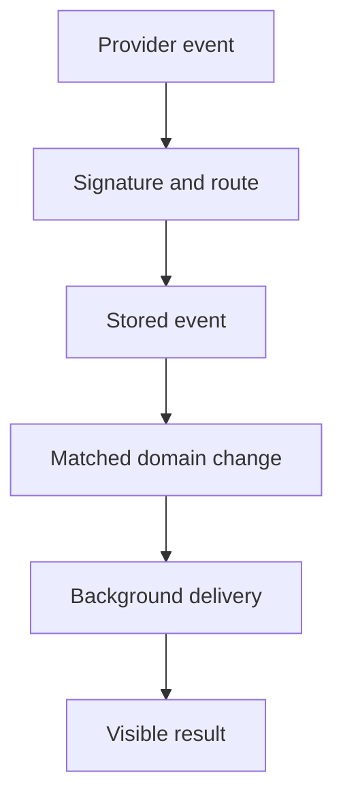

# Webhook Troubleshooting

Check validation, persistence, domain changes and background delivery in order.

## In this guide

First Checks · Matching Revocations · Duplicate Events · Provider-Specific Notes · Stripe ReFit Commissions

Store webhooks keep Orbiters close to the provider's sale and license state. They are especially important for refunds, revocations, chargebacks, and sale mirrors.

## First Checks

1. Confirm the store integration is active.
2. Confirm the provider supports webhooks for the account.
3. Confirm the integration has a webhook secret.
4. Confirm recent provider events appear in Orbiters.
5. Confirm the related product is linked to an Orbiters asset.

## Matching Revocations

Orbiters disables access only when a revocation can be safely matched. A provider event is easier to match when it contains:

- an external sale ID,
- a product ID,
- a license key or short key,
- enough metadata to connect to a mirrored sale.

If a refund happened in the provider but access did not change in Orbiters, check whether the event included a matchable key or sale ID.

## Duplicate Events

Duplicate processed webhook events are ignored. Failed events can be retried by sending the same provider event again.

## Provider-Specific Notes

Gumroad and Lemon Squeezy use signed webhook flows. Jinxxy support depends on account features. Payhip license verification is supported through product secret keys; webhook behavior is limited by provider capabilities.

## Stripe ReFit Commissions

ReFit commission requests use Stripe Checkout on the Orbiters platform account with
manual capture. The EUR 2 request fee is received by the website administrator; a
creator does not connect a Stripe account and Orbiters does not collect the
creator's separate commission price.

Configure Stripe from **Admin > API Keys** by adding a global **Stripe platform**
credential for the Orbiters deployment that processes the request (`dev` for
local/development or `prod` for the deployed site). Stripe sandbox keys can be used
in either deployment while testing, but the publishable and secret keys must both
be test keys or both be live keys. Enter those keys and the Account webhook signing
secret. The setup panel displays the exact webhook URL; for production it is
`https://api.orbiters.cc/stripe/webhook`. Configure these Account events:

- `checkout.session.completed`
- `payment_intent.amount_capturable_updated`
- `payment_intent.canceled`
- `payment_intent.payment_failed`

In the selected Stripe sandbox, open **Workbench > Webhooks**, select **Create an
event destination**, and choose **Events on your account**. Select the four events
above, continue with **Webhook endpoint**, and paste the URL displayed by Orbiters.
After creating the destination, open its details and select **Click to reveal**
under **Signing secret**. Copy the resulting `whsec_...` value into the existing
Stripe platform credential in **Admin > API Keys**. The API-key edit dialog repeats
these steps and displays a copyable endpoint URL.

`STRIPE_PUBLISHABLE_KEY`, `STRIPE_SECRET_KEY`, and `STRIPE_WEBHOOK_SECRET`
environment variables remain deployment overrides. Database credentials are
encrypted and selected by Orbiters environment. `FRONTEND_URL` controls where
Checkout returns after authorization.

The secret key alone enables Stripe API calls, but commission listings and new
requests stay disabled until the webhook signing secret is also present. This keeps
the request queue from accepting payments that it cannot reconcile.

On a `dev` deployment, a creator can use **Create a ReFit request** in the
Commissions tab to create a self-addressed dummy request and continue through the
real platform Checkout. This development shortcut requires the platform secret key
but not the webhook because the Checkout return page refreshes the PaymentIntent
directly. The frontend uses the same development API URL signal as the home-page
warning, while the backend accepts only an explicitly development-configured or
local/development API host. The backend returns `404` elsewhere; this is never a
production fallback for webhook delivery.

If a paid draft remains in **Waiting for payment authorization**, confirm the
Checkout event arrived and the PaymentIntent reached `requires_capture`. If a
request remains in **Creator acceptance is being finalized**, check Stripe capture
status and the persisted Board destination. The commission scheduler retries stale
acceptances idempotently; network failures do not cancel the request, while a card
decline or non-capturable authorization does.

<audience include="dev">

Webhook routes preserve the raw request body for signature validation. Provider modules own signature validation and webhook parsing. Do not validate signatures in route code unless the provider module delegates that exact concern.

</audience>