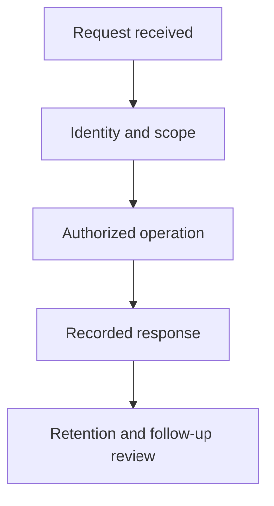

# Privacy and Compliance Operations

Receive the request, establish scope, perform the authorized action and record the result.

## In this guide

Handle a Privacy Request · Decide Content Reports and Appeals · Maintain the Compliance Register · Seller Tax Reporting · Retention and Release Review

Use **Admin → Privacy and reports** for the queues. Moderators handle content cases;
admins and owners can also manage privacy requests, the compliance register and
private seller reporting. Account closure, owner hiding and staff restrictions are
separate actions with separate authority checks.

## Handle a Privacy Request

Prioritise the displayed due date. Review the request, verify identity proportionately
when necessary, perform the requested action or record a justified refusal, and save
an understandable response. Changing a case to completed records your response; it
does not itself redact shared records or make external providers erase data.

The original deadline is one calendar month. A single reasoned extension must be
recorded and notified within that month, with a total deadline of three calendar
months from receipt. Closed requests cannot be silently reopened. Requests received
by email, including from people without an account, still need operational handling.

Self-service exports run as outbox jobs. Check failed jobs when an export remains
processing. Do not forward a user's authenticated download link as an email attachment.

## Decide Content Reports and Appeals

Reports retain a target reference and limited evidence. Record a decision and reasons.
**Restricted** removes the affected public surface while keeping authorised private
commission history. Restricting a user target hides that profile, not all content
in which that person participates. **Reviewing** preserves an existing restriction.
**No action** or **Resolved** removes that case's restriction. Other active cases
and owner visibility choices still apply.

Affected account holders receive a moderation notification and can contest the
decision. Each participant can submit their own appeal. Opening an appeal does not
silently change the restriction. Give a reasoned outcome after reviewing it.

For a ReFit fee dispute, an admin or owner can request a refund of the captured
Orbiters fee from the case. The outbox retries the same Stripe refund idempotently.
Pending and successful refunds appear in the commission payment state. Creator
payments are received directly by creators and require their own resolution.

## Maintain the Compliance Register

Each record has an accountable owner, review date, status, version and audit event.
Complete the required facts before approving:

| Record | Required operational evidence |
| --- | --- |
| Processing | Purpose, subjects, sources, categories, legal basis, recipients, retention, erasure and risk assessment |
| Vendor | Service, role, data categories, processing locations, transfer safeguard, contract review and exit process |
| Risk assessment | Feature, triggers, necessity, risks, mitigations and decision |
| Incident | Awareness timestamp, affected data, risk, containment and notification decisions |
| Applicability | Scope, decision and rationale |

Compare configured integration providers with reviewed vendor records. Configuration
is an inventory aid; it does not establish a lawful basis or a signed contract.
For incidents, the awareness time calculates a 72-hour assessment deadline. Record
whether authority and affected-person notifications are required and the evidence
of action; the website does not submit regulatory notifications.

An approved applicability record with key **commerce_age** can require existing
verified 18+ status independently for buyers and sellers. No new age requirement
is enabled until that decision is approved.

## Seller Tax Reporting

Only an approved **dac7** applicability record with **Applicable** selected enables
private tax collection. Sellers then provide identity and tax-residence information
in seller setup. It is encrypted separately from public seller details. Staff access
is audited. Verification records the exact version reviewed; changed details must
be reviewed again.

Download the annual review dataset after selecting a year. It groups creator-recorded
direct receipts by seller, quarter and currency. It does not apply the goods
small-seller exemption to personal services. Reconcile missing receipts, corrections,
reportable activities, platform fees, currency treatment and the applicable scope.
The JSON is a review dataset, not an authority-format return or a filing. Complete
the authority's filing process and required seller notices, then record that work
in the compliance register.

## Retention and Release Review

Hourly maintenance removes expired export files, expired audit evidence, completed
rights cases after three years and eligible resolved moderation cases after a year.
Unresolved cases and active restrictions remain. Notifications, inactive push
subscriptions and age audit events have 180-day limits. Private seller tax profiles
have an explicit ten-year retention date. Provider-revocation credentials are cleared
on confirmed revocation or after at most seven days of retries.

Before production use, confirm the actual hosting/vendor contracts and transfer
safeguards, the applicable DSA and tax scope, and required professional consumer
information and mediation arrangements. These are operator decisions and obligations;
an approved software record is not independent legal verification. Reconcile the
published notice and retention policy with actual practice and backup expiry.

Primary references: [CNIL rights](https://www.cnil.fr/fr/reglement-europeen-protection-donnees/chapitre3),
[CNIL erasure](https://www.cnil.fr/fr/comprendre-mes-droits/le-droit-leffacement-supprimer-vos-donnees-en-ligne),
[French DSA guidance](https://www.economie.gouv.fr/dgccrf/dsa-de-nouvelles-obligations-pour-les-professionnels).