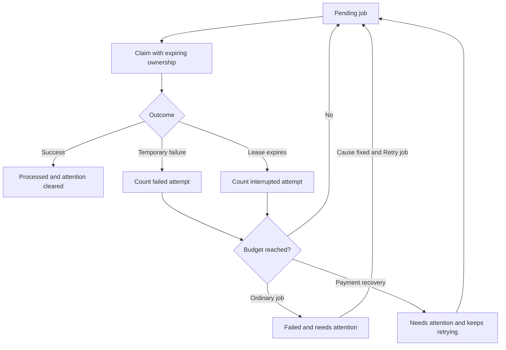

# Get background work moving again

Open **Admin → Background jobs** when repeated failures or worker interruptions need investigation. This operational view is available to administrators and owners; developer rank alone does not authorize it.

The list shows job IDs, operation types, state, failed attempts, interrupted attempts and the next scheduled attempt. It omits payloads and raw error text, which can contain private provider or customer details.

## Decide what needs fixing

| State in the view | Meaning | Your next step |
| --- | --- | --- |
| Recovery continuing | Work is still eligible to run but has crossed an attention threshold | Check configuration and provider availability; let recovery continue |
| Failed | Automatic attempts stopped | Resolve the cause, then select Retry job |
| Queued after manual retry | The same durable job is scheduled again | Refresh later; its flag clears after successful completion |
| No entries | No retained failure or attention flag matches the list | Investigate a specific user workflow if the symptom persists |

Use the job ID to correlate server logs. Check the affected integration, bot permissions, payment account/mode or destination Board. Do not copy a complete provider response into a public support discussion.

## Payment uncertainty needs reconciliation

A missing response does not prove that a provider rejected the operation. Commission recovery and platform-fee refund jobs continue after the ordinary retry budget, while remaining visible here. Explicitly non-retryable failures still stop.

Do not create a replacement charge or manually mark a payment successful to silence the warning. Restore the expected configuration and let the payment service query the provider's actual outcome.

## Retry deliberately

1. Read the operation type and attempt counts.
2. Establish the cause in the corresponding service or integration view.
3. Correct that cause.
4. Retry only a **Failed** job. The server rejects attempts to replay a job that has already moved on.
5. Refresh and verify both the queue result and the affected user workflow.

The page loads 50 entries at a time. Use **Load more jobs** for older entries. It is an attention queue, not a complete history of every successful operation.

<audience include="dev">

## Worker and schema contract

Each claim receives a UUID `claimToken` and a five-minute `leaseExpiresAt`. A heartbeat renews it every 100 seconds. Completion, failure and renewal require the current token and an unexpired lease. A replaced worker cannot update the row, even if its external call later returns.

Jobs are claimed immediately before execution, one at a time. Each run handles up to ten. Recovery scans at most 100 expired claims and increments `recoveryCount`; handler failures increment `retryCount`. Backoff grows to at most one hour. Repeated failures or recoveries set `needsAttentionAt` without introducing a second domain status.

`outboxLeases.prepare` adds columns transactionally before sync, backfills missing recovery counts and assigns finite leases to interrupted pre-upgrade rows. It preserves existing non-null data. The populated-upgrade regression also verifies partial schemas and repeated boots.

**A lease fences database writes, not vendor side effects.** Payment services still need their existing idempotency and reconciliation rules. Handlers must remain safe when execution overlaps after loss of ownership.

Routes: `GET /admin/outbox` and `POST /admin/outbox/:id/retry`. Both require authenticated administrative authorization and return private, non-cacheable responses.

</audience>
