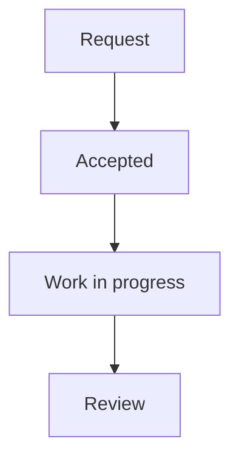

# Mermaid Documentation Diagrams

Write a fenced `mermaid` block in a documentation Markdown file. No image export
or image upload is needed. The website asks the backend for a transparent PNG,
which is generated on first access and reused from disk thereafter.

## Author a diagram

````markdown

````

Use `accTitle` for the caption and a single-line `accDescr` for the image's text
alternative. Explain important decisions in the surrounding prose too. Keep
diagrams short, preferably top-to-bottom, and split large workflows into separate
diagrams. Narrow screens can scroll diagrams horizontally without shrinking labels.

Only documentation Mermaid blocks are rendered. Other code blocks remain code;
this does not enable executable HTML or Mermaid in user messages. Global theme
and security configuration belongs to the renderer, not document directives.
Mermaid YAML frontmatter and `%%{...}%%` configuration directives are rejected.

## Runtime and cache

- Backend Node.js must be at least 22.12.0. Run `npm install` after updating.
- Puppeteer installs its matching Chrome browser during dependency installation.
  Do not skip that installation unless supplying `PUPPETEER_EXECUTABLE_PATH`.
- The backend Dockerfile installs Chrome and its Linux system dependencies. Rebuild
  the backend image when deploying this feature; restarting an older image is not enough.
  Local dependencies, secrets, uploads and generated caches are excluded from the
  image build context; supply runtime configuration and persistent data separately.
- For a Linux installation outside Docker, install the browser dependencies with
  `npx puppeteer browsers install chrome --install-deps` using appropriate system privileges.
- `DOCUMENTATION_DIAGRAM_CACHE_DIR` selects a writable cache directory. The default
  is `backend/.cache/documentation-diagrams`, outside the documentation repository.
  Mount a persistent directory there if cache reuse across container replacement is desired.
- Keys include normalized Mermaid source, renderer policy revision, Mermaid version
  and Puppeteer version. Editing a diagram generates a new image automatically.
- Requests for the same diagram share one render within a backend process. Up to
  four distinct misses can queue; rendering is serial to bound browser resource use.
  Separate backend processes may render the same miss, but publish complete files atomically.
- Cache pruning runs on new renders at most once an hour. PNGs older than 30 days
  or beyond the newest 128 MiB are discarded and regenerated if requested again.
- Limits: 24 diagrams per page, 12,000 source bytes per diagram, 150 edges,
  2,400 by 3,000 CSS pixels, and 8 MiB per PNG. Split oversized diagrams.

Generation has bounded launch/render timeouts. If generation fails, the rest of the
page remains readable and a **Retry diagram** button is available. Failed images are
not cached. The PNG is transparent and the website displays it on a dark diagram
surface for consistent contrast in either website theme.

## Access and safety

Every image request rechecks the document's current audience, release stage and
inline visibility before consulting the cache. Knowledge Base requests also honor
its source visibility settings. Removed diagrams are no longer downloadable through
their old IDs. Image responses are private and not cached by the browser; the
frontend fetches them with the normal authenticated API, not tokens in image URLs.

The renderer accepts only diagrams found in readable repository documentation;
there is no arbitrary-source rendering endpoint. Mermaid uses strict security,
HTML labels are disabled, and page network requests are blocked. The root-based
Docker backend disables Chrome's OS sandbox to allow it to launch: keep repository
write access trusted and do not expose this renderer to arbitrary user input.

Run `MERMAID_RENDER_TEST=true node --test test/documentationDiagrams.test.js` from
the backend for a real local-browser PNG and invalid-syntax test. Normal unit and
route tests use local fixtures and do not require a browser or external network.
