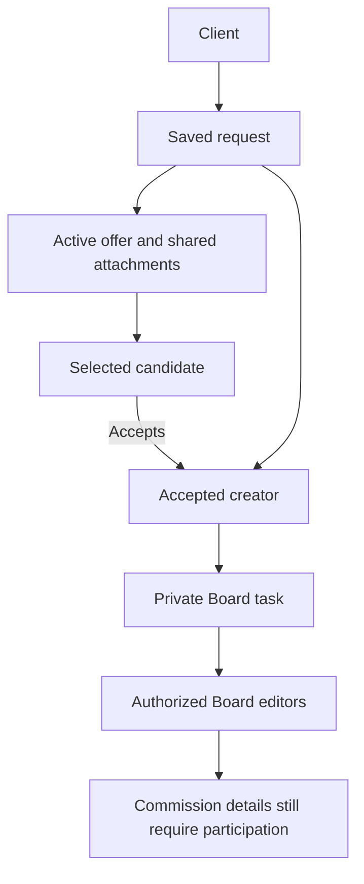

# Who sees what

Use this map when reviewing a screen, writing a guide or investigating an access report. First identify **the resource**, then **the caller's relationship to it**. A rank is only part of that answer.

## Documentation: two independent gates

Try **Admin → Alpha** in the example. The experimental developer guide stays unavailable. Then try **Developer → Stable**: the same guide is still hidden, for a different reason. This is the difference between an audience and a release mode.

```orbiters
{"kind":"audience-lens"}
```


| Base profile | Documentation audience set |
| --- | --- |
| Visitor | public |
| Signed-in member | public, user |
| Creator member | public, user, creator |
| Moderator | public, user, mod |
| Admin | public, user, mod, admin |
| Developer or owner | public, user, creator, mod, admin, dev |

The creator flag adds `creator` to a moderator or admin account. **Admin rank alone does not add creator or dev.** A page tagged `creator, admin, dev` accepts any one of those tags; a page tagged only `creator` has a different audience.

Stable mode shows stable material. Beta adds beta material. Alpha adds both beta and alpha. Selecting alpha does not grant another audience. Knowledge source rules and token audience ceilings can reduce access further.

Open the [page-by-page audience catalog](/documentation/orbiters.reference.documentation-audience-catalog) to review the declared splits across the corpus.

## Commission records: relationship matters

| Information or action | Client | Active ReFit candidate | Accepted creator | Other Board editor | Platform staff |
| --- | --- | --- | --- | --- | --- |
| Full ReFit brief and client identity | Yes | No | Yes | No automatic access | No blanket grant |
| Submitted ReFit attachments | Yes | During active offer | Yes | No automatic access | No blanket grant |
| Request fee/payment details | Own request | No | Limited operational context | No | Dedicated authorized tools |
| Artist payment record | Read | No | Read and edit | No automatic access | No blanket grant |
| Delivery controls | Read progress | No | Update progress | No automatic access | No blanket grant |
| Next-action cue | Own action | Respond to valid offer | Own action | Only if also a participant | No blanket grant |

The attachment itself can identify its subject even when text fields are withheld. Review the sharing stage, not just the JSON fields.



Art requests are shared between the client and artist. Their state transitions remain creator-controlled, except the client's permitted cancellation of a pending request. A review cue invites the client to inspect the work and discuss feedback; it does not add a new approval endpoint.

## Public content, private work and external copies

| Surface | Visibility rule to check |
| --- | --- |
| Public profile and asset listing | Published content and applicable hiding/moderation controls |
| Private Board | Board access plus underlying proposal or issue access |
| Commission request | Participant and request-stage checks |
| Trello-uploaded reference | Trello Board membership controls the uploaded copy |
| Private file or cached preview | Authorization still applies when serving cached bytes |
| Account export | The requesting account and privacy workflow |
| Administration tool | The route's permission check and, where used, feature access |

An Orbiters disconnect does not recall copies already uploaded to an external Board. Document that boundary before a user selects an external destination.

## Inspect the split in the reader

Admins, developers and owners receive a **Who can read this page?** panel. Its badges describe base account profiles. Enable **Mark audience and release boundaries** to see where a permitted restricted section starts and ends.

The toggle never reveals excluded content. An admin cannot use it to read a dev-only block. Public and member responses do not receive the inspection panel. The same source content still passes through server-side filtering before search, page delivery and diagram lookup.

<audience include="dev">

## Implementation checklist

1. Enforce resource permissions in the backend, not through a hidden button.
2. Build next actions from current state and the viewer's actual relationship.
3. Preserve source/token audience ceilings in Knowledge reads.
4. Recheck diagram access against the caller's filtered document.
5. Test an unrelated user, an admin without the creator flag, and a limited token.

The owning services are `documentationService`, `documentationVisibility`, `knowledgeIndexService` and `commissionNextAction`. The inspection view explains their decisions; it does not replace those checks.

</audience>
