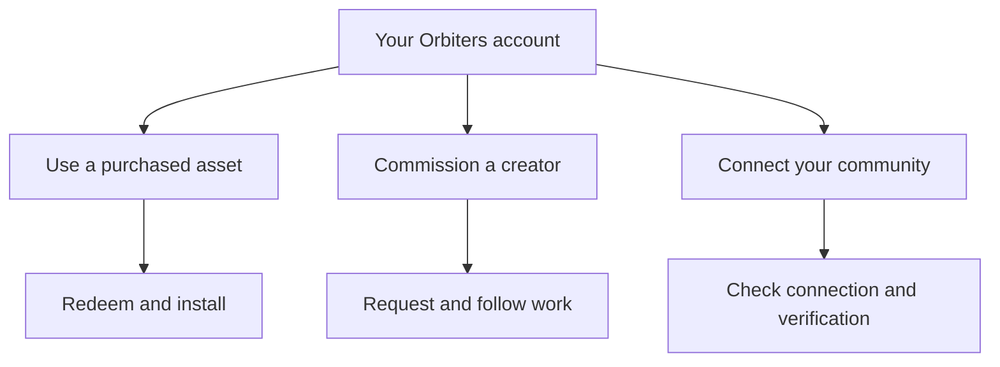

# Make something. Find what you need.

Orbiters brings creator assets, community access and commissioned work together. Start with the outcome you want; you do not need to understand the whole platform first.

| I want to… | Start here | What I will leave with |
| --- | --- | --- |
| Use something I bought | [Redeem a license](/documentation/orbiters.how-to.redeem-license-key) | Access attached to my account |
| Explore my assets | [Assets and downloads](/documentation/orbiters.how-to.assets-and-downloads) | A version I can download or install |
| Ask for a better fit | [Request a ReFit commission](/documentation/orbiters.how-to.request-refit-commission) | A saved request and a place to follow it |
| Understand my community status | [Community age verification](/documentation/orbiters.account.age-verification) | The evidence behind my current status |

## Four ideas worth knowing

**An asset** is a creator's published item. **A version** is a release of that item. **Access** determines which releases your account can use. **A commission** is work requested from a creator, with its own participants, progress and payment records.

A successful website sign-in does not by itself grant an asset, a Discord role or community verification. Each workflow checks its own evidence.

## Find your place

Documentation is tailored to your account. Public guides are available to everyone; signed-in users, creators and staff receive the material their account can read. The stable, beta and alpha selector is a separate release filter.

<audience include="creator, admin, dev">

**Building your creator workspace?** Continue with [the documentation map](/documentation/orbiters.start.documentation-map), then connect your store, publish assets and configure commissioned work.

</audience>

<audience include="admin, dev">

**Supporting or developing Orbiters?** Open [Who sees what](/documentation/orbiters.reference.visibility-atlas). The reader's visibility panel shows page audiences; its inspection switch marks restricted sections without expanding your access.

</audience>
