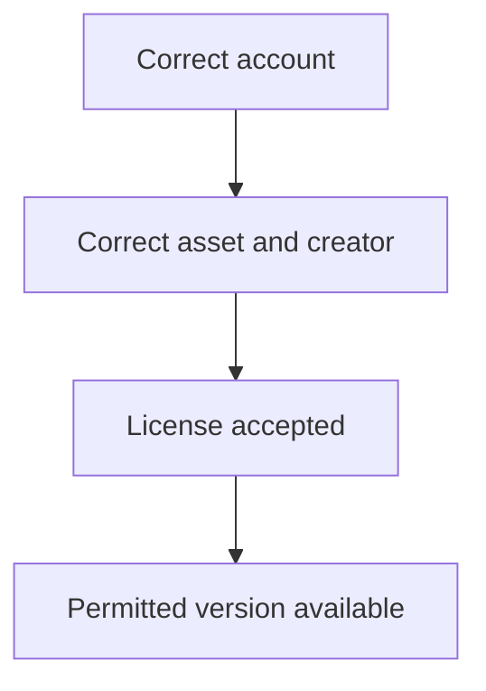

# Your first asset, from receipt to download

By the end of this tutorial, you will know which account owns your access and where to find an available version.

## Before you begin

Use a license from a supported connected store. Keep the creator name and purchase receipt nearby. Sign in to the Orbiters account you intend to keep using.

## 1. Find the asset

Open its page and check the creator and product name against your receipt. This avoids redeeming a key while looking at a different item.

## 2. Redeem your purchase

Paste the key into the license field and submit. If the website asks who sold it, select that creator and continue. Wait for the access result before attempting another submission.

## 3. Open an available version

Return to the asset's versions. Choose a release your account can access. Public access does not automatically include beta or alpha releases.

## 4. Check the result

You are finished when the asset is associated with your account and its permitted download or install action is available. A Discord role may arrive afterward through the background queue.

## If you get stuck

Use [Redeem a license key](/documentation/orbiters.how-to.redeem-license-key) to interpret the result. Keep the seller, asset and error message when asking for help. Do not post the complete license key in public comments.

Next, explore [assets and downloads](/documentation/orbiters.how-to.assets-and-downloads).
